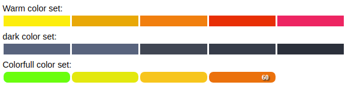

# React Progress Bar
***
#### A React component to display progress bar with thresholds and chanks of values

## Install
```
npm i -S react-progress-bar-steps
```
```
yarn add react-progress-bar-steps
```
## Usage
```
import StepsPrograssBar from 'react-progress-bar-steps';

ReactDOM.render(<div>
<StepsPrograssBar />
</div>)
```
## API

### props
						
| name        | type           | default  | description |
| :------------- |:-------------:| :-----: | :-------------- |
| showPrecentage | String | null | can get 'start' or 'end' ( display precentage number on the graph ) |
| colors | Array | [] | default empty Array, if recived will determen the number of chanks and there colors |
| colorSet | String | 'colorfull' | default color set - can be 'colorfull', 'warm', 'dark'. to make it work **colors** prop shuld be empty Array|
|partialValue | Number | 98 | the value of the precentage to be calculate |
|totalValue | Number | 100 | the total amount from witch precentage will be taken |
| isStepIncrese | Bool | false | default False, if true will start as a small chank and grow at the end |
| pWrapStayle | Object | {} | give user style controll for wrap |
| chankStyle | Object | {} | give user style controll for chank div component |
| pTextStyle | Object | {} | give user style controll for text precantage |
| firstElStyle | Object | {} | give user style controll for first chank |
| lastElStyle | Object | {} | give user style controll for last chank |

## License
rc-progress is released under the MIT license.
